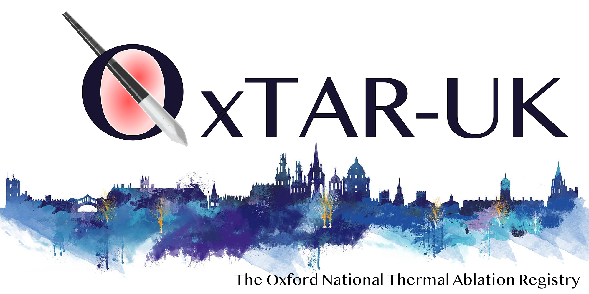

{#id .class width=70% height=70%}

## OxTAR-UK: The Oxford National Thermal Ablation Registry

OxTAR-UK is a national UK registry for thermal ablation of tumours, specifically CT- or Ultrasound-guided percutaneous microwave or cryo-ablation of lung, liver, adrenal, kidney, musculoskeletal soft tissue & bone tumours.

It uses the Castor EDC platform and can be accessed using this link: <https://uk.castoredc.com>

This Graphical User Inferface uses the EDC Application Programmers Interface (API) to access the live Castor EDC data via the R scripting language. It can be used to used to generate plots of time to treatment (based on referral data), local recurrence and survial (based on the imaging and follow-up data).

V0.74 (c) July 2024
Conception, Design, Implementation: Dr. Paul C. Lyon (<paul.lyon@ouh.nhs.uk>)
Contributors: Dr. Mark Anderson, Dr. Yan Li
